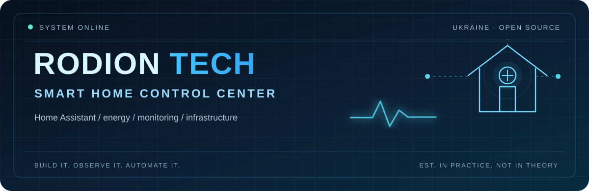
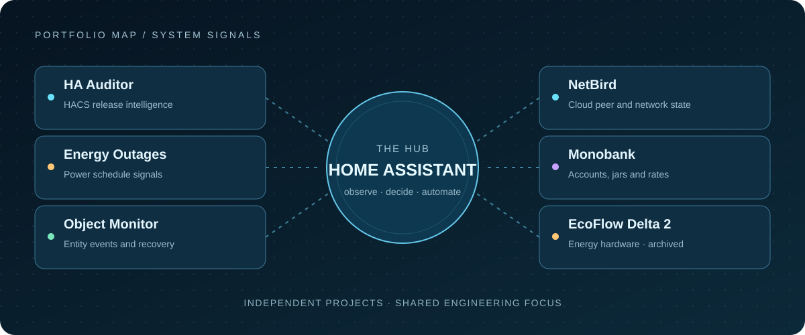

<strong>I build Home Assistant integrations that make real systems easier to observe, understand and operate.</strong>

Smart home engineering · Energy resilience · Infrastructure monitoring · Open source

<a href="#featured-systems">Explore projects</a> · <a href="#how-it-fits-together">See the system</a> · <a href="#connect">Get in touch</a>

## The mission

I'm Rodion, an engineer in Ukraine working where Home Assistant meets physical devices, energy systems and self-hosted infrastructure. I build tools that turn updates, outages, device events and network state into information people can actually use.

My work favors clear states, useful diagnostics and honest handling of missing data. If a system cannot tell you what it knows, it is hard to trust when it matters.

## Featured systems

<table>
  <tr>
    <td width="50%" valign="top">
      01 / UPDATE INTELLIGENCE 
      <h3><a href="https://github.com/rodion981/ha-auditor">🛡️ HA Auditor</a></h3>
      
Understand HACS updates before installing them. Reads release notes, highlights meaningful changes and reports when an audit is incomplete.

      <a href="https://github.com/rodion981/ha-auditor">Explore the integration ↗</a>
    </td>
    <td width="50%" valign="top">
      02 / ENERGY RESILIENCE 
      <h3><a href="https://github.com/rodion981/ha-energy-outages">⚡ Energy Outages</a></h3>
      
Bring Kyiv outage schedules into Home Assistant, with today and tomorrow's periods and an “outage now” binary sensor.

      <a href="https://github.com/rodion981/ha-energy-outages">Explore the integration ↗</a>
    </td>
  </tr>
  <tr>
    <td width="50%" valign="top">
      03 / OBJECT OBSERVABILITY 
      <h3><a href="https://github.com/rodion981/ha-object-monitor">📡 Object Event Monitor</a></h3>
      
Turn label-selected entity changes into Home Assistant events for availability, recovery and other multi-site automations.

      <a href="https://github.com/rodion981/ha-object-monitor">Explore the integration ↗</a>
    </td>
    <td width="50%" valign="top">
      04 / NETWORK VISIBILITY 
      <h3><a href="https://github.com/rodion981/ha-netbird">🌐 NetBird for Home Assistant</a></h3>
      
Read-only monitoring of NetBird Cloud peers and current network topology. Connection state is not a VPN path test.

      <a href="https://github.com/rodion981/ha-netbird">Explore the integration ↗</a>
    </td>
  </tr>
  <tr>
    <td width="50%" valign="top">
      05 / FINANCIAL DATA 
      <h3><a href="https://github.com/rodion981/ha-monobank">💳 Monobank</a></h3>
      
Bring account balances, jars, exchange rates and API status into Home Assistant, with webhook updates for transactions.

      <a href="https://github.com/rodion981/ha-monobank">Explore the integration ↗</a>
    </td>
    <td width="50%" valign="top">
      06 / ENERGY HARDWARE · ARCHIVED 
      <h3><a href="https://github.com/rodion981/ecoflow-delta2-homeassistant">🔋 EcoFlow Delta 2</a></h3>
      
Earlier Home Assistant integration for monitoring and controlling an EcoFlow Delta 2 through the official API.

      <a href="https://github.com/rodion981/ecoflow-delta2-homeassistant">View archived project ↗</a>
    </td>
  </tr>
</table>

## How it fits together

  

These projects share a practical goal: bring signals from different parts of a home or homelab into a place where they can be inspected and used. Each integration stands on its own; the map shows the areas I work on, not a required deployment architecture.

## Engineering principles

| Principle | What it means in practice |
| --- | --- |
| **Observe before acting** | Expose useful state and diagnostics so failures are easier to trace. |
| **Show uncertainty** | Treat unavailable, incomplete and stale data differently from a real zero or `off`. |
| **Design for disruption** | Make energy and network conditions visible to the people operating the system. |
| **Keep it maintainable** | Prefer small, documented integrations that fit Home Assistant conventions. |

## Tools I work with

`Home Assistant` · `Python` · `YAML` · `PowerShell` · `Zigbee` · `MQTT` · `Proxmox` · `Docker` · `Linux` · `GitHub Actions`

Community work and maintained forks

- [ha-aerial-danger](https://github.com/rodion981/ha-aerial-danger)
- [homeassistant-blitzortung](https://github.com/rodion981/homeassistant-blitzortung)
- [ha-ukr-hmc](https://github.com/rodion981/ha-ukr-hmc)
- [power-flow-card-plus](https://github.com/rodion981/power-flow-card-plus)
- [lunar-phase-card](https://github.com/rodion981/lunar-phase-card)
- [lovelace-blitzortung-lightning-card](https://github.com/rodion981/lovelace-blitzortung-lightning-card)

## Connect

Find me on [LinkedIn](https://www.linkedin.com/in/rodion-kurylenko-tech/) or [Reddit](https://reddit.com/user/rodyon009). If you find an issue in one of my projects, the repository's issue tracker is the best place to report it.

**RODION TECH // SMART HOME CONTROL CENTER**

Build it. Observe it. Automate it. · 🇺🇦 Built in Ukraine

[Support my work](https://paypal.me/rodyon009)

