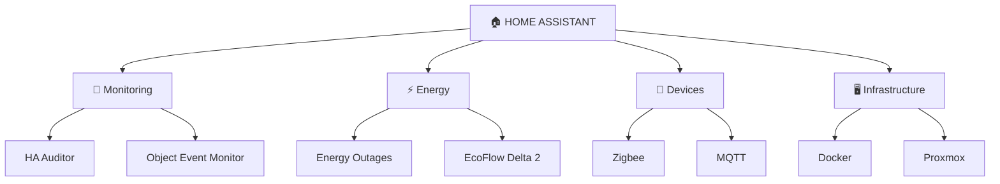

<div align="center">


### 🏠 Building useful Home Assistant integrations for real-world smart homes

`Home Assistant` · `Smart Home` · `IoT` · `Energy` · `Self-hosted` · `Python`

<br>

[](https://www.home-assistant.io/)
[](https://github.com/rodion981)


</div>

---

## ⚡ What I Build

I build tools and integrations around **Home Assistant**, smart-home infrastructure and automation.

My main interests are:

* 🧩 Home Assistant custom integrations
* ⚡ Energy monitoring and power resilience
* 📡 Device and infrastructure monitoring
* 🏠 Smart-home automation
* 🔌 Zigbee, MQTT and IoT
* 🐳 Docker and self-hosted services
* 🖥️ Proxmox homelab infrastructure

---

# 🚀 Featured Projects

### 🛡️ [HA Auditor](https://github.com/rodion981/ha-auditor)

**Understand HACS updates before you install them.**

Home Assistant integration that audits GitHub releases for installed HACS integrations, highlights important changes and keeps actionable findings inside Home Assistant.

[](https://github.com/rodion981/ha-auditor/stargazers)

[](https://github.com/rodion981/ha-auditor)

---

### ⚡ [HA Energy Outages](https://github.com/rodion981/ha-energy-outages)

Power outage schedules directly inside Home Assistant.

Provides today's and tomorrow's outage periods, 30-minute precision and a binary sensor showing whether an outage is active right now.

[](https://github.com/rodion981/ha-energy-outages/stargazers)
[](https://github.com/rodion981/ha-energy-outages/releases)


---

### 📡 [Object Event Monitor](https://github.com/rodion981/ha-object-monitor)

Event-driven monitoring for homes, offices, restaurants and other remote locations.

Uses Home Assistant labels to detect availability, recovery, security and state changes and exposes them as automation-friendly events.

[](https://github.com/rodion981/ha-object-monitor/stargazers)


---

### 💳 [Monobank for Home Assistant](https://github.com/rodion981/ha-monobank)

Bring Monobank data into Home Assistant.

Account balances, jars, exchange rates, webhook updates, API status and configurable update intervals.

[](https://github.com/rodion981/ha-monobank/stargazers)


---

### 🔋 [EcoFlow Delta 2](https://github.com/rodion981/ecoflow-delta2-homeassistant)

Custom Home Assistant integration for monitoring and controlling an **EcoFlow Delta 2** through the official EcoFlow API.

---

# 🧠 About Me

```yaml
name: Rodion

focus:
  - Home Assistant
  - Smart Home & IoT
  - Automation
  - Energy Monitoring
  - Self-hosted Infrastructure

home_automation:
  - Home Assistant
  - HACS
  - Zigbee
  - MQTT
  - YAML

infrastructure:
  - Proxmox
  - Docker
  - Linux
  - Self-hosted services

development:
  - Python
  - PowerShell
  - Git
  - GitHub Actions

currently_building:
  - HA Auditor
  - Object Event Monitor
  - Energy integrations
  - Smart-home utilities

philosophy:
  "If something can be monitored or automated, it probably should be."
```

---

# 🗺️ Smart Home Ecosystem



---

# 🛠️ Tech Stack

<div align="center">


</div>

---

<details>

<summary><b>🌍 Community work & maintained forks</b></summary>

<br>

I also experiment with and maintain changes to existing Home Assistant projects.

* ⚠️ [ha-aerial-danger](https://github.com/rodion981/ha-aerial-danger)
* 🌩️ [homeassistant-blitzortung](https://github.com/rodion981/homeassistant-blitzortung)
* 🇺🇦 [ha-ukr-hmc](https://github.com/rodion981/ha-ukr-hmc)
* ⚡ [power-flow-card-plus](https://github.com/rodion981/power-flow-card-plus)
* 🌘 [lunar-phase-card](https://github.com/rodion981/lunar-phase-card)
* 🌩️ [lovelace-blitzortung-lightning-card](https://github.com/rodion981/lovelace-blitzortung-lightning-card)

</details>

---

# 📊 GitHub

<div align="center">


<br><br>


</div>

---

# 🌐 Connect

<div align="center">

[](https://linkedin.com/in/rodion-kurylenko-3924b82a9)

[](https://reddit.com/user/rodyon009)

<br>

[](https://paypal.me/rodyon009)

</div>

<br>

<div align="center">

### 🏠 Automate everything.

<sub>Making homes a little smarter, one integration at a time.</sub>

</div>


